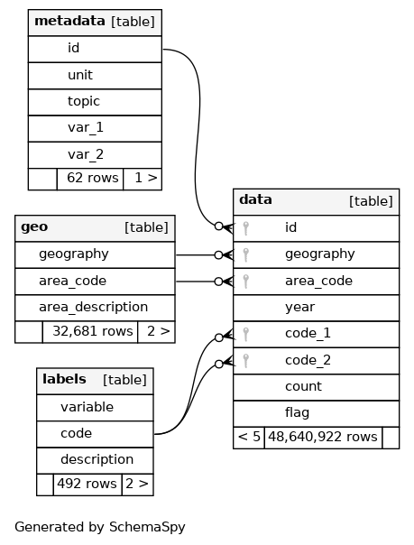

[Statistics New Zealand](https://www.stats.govt.nz) publish a useful dataset called [Statistical area 1 dataset for 2018 Census](https://www.stats.govt.nz/information-releases/statistical-area-1-dataset-for-2018-census-updated-march-2020) (updated March 2020).  While this is an interesting dataset, it is extremely hard to use as published.  This project contains a single R script, [`R/get_and_tidy_sa1_data.R`](R/get_and_tidy_sa1_data.R), which can be used to import the following file and convert it into something more directly usable:

[https://www3.stats.govt.nz/2018census/SA1Dataset/Statistical%20Area%201%20dataset%20for%20Census%202018%20%E2%80%93%20total%20New%20Zealand%20%E2%80%93%20Long%20format_updated_16-7-20.zip?_ga=2.233376093.2109497880.1650238923-1811039537.1593540342](https://www3.stats.govt.nz/2018census/SA1Dataset/Statistical%20Area%201%20dataset%20for%20Census%202018%20%E2%80%93%20total%20New%20Zealand%20%E2%80%93%20Long%20format_updated_16-7-20.zip?_ga=2.159648894.2109497880.1650238923-1811039537.1593540342)

The script will output two types of output:

* a single SQLite database
* a collection of 4 gzipped CSV files

The SQLite database will be output to `output/sqlite`.  Once created it is around 2.5GB in size, though 1.1GB of that is taken up in a single index!  It has the following schema:

The CSV files match the SQLite tables, and are output to `output/csv` as follows:

file                         | size on disk
-----------------------------|--------------------------------
`output/csv/geo.csv.gz`      | 157Kb 
`output/csv/metadata.csv.gz` | 1.2Kb
`output/csv/labels.csv.gz`   | 4.8Kb
`output/csv/data.csv.gz`     | 161Mb
